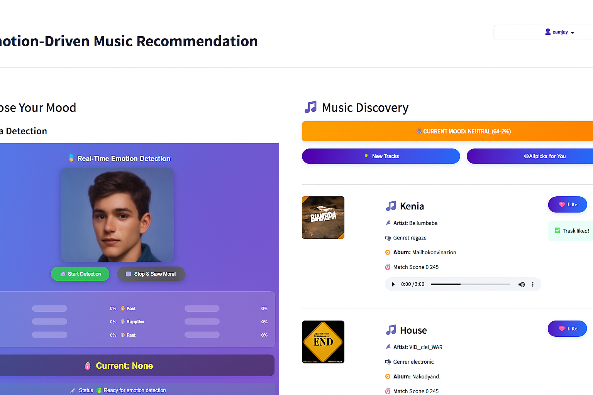
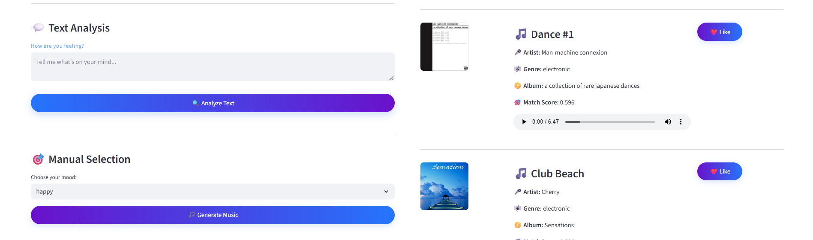
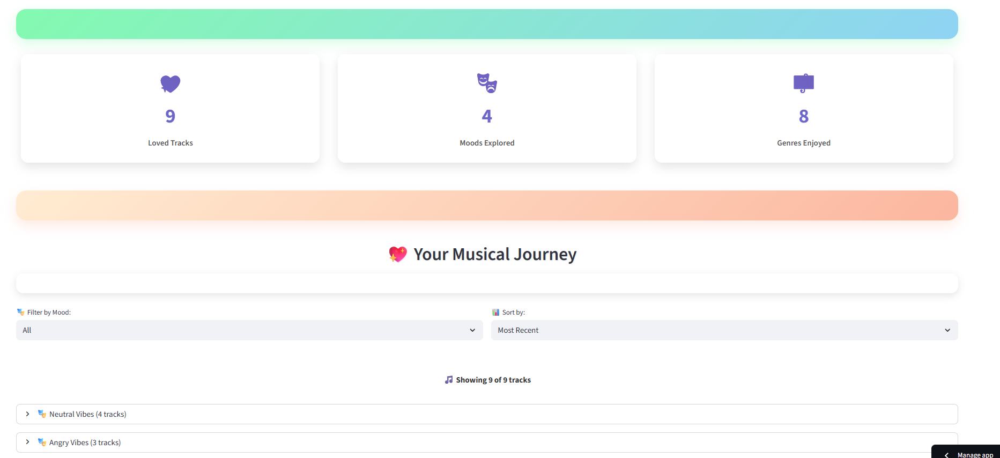

# Sentiment Symphony: Intelligent Mood-to-Music Engine

- An interactive multi-modal music recommendation system that adapts to the user’s mood and preferences.
The system supports emotion detection via camera, text analysis, and manual selection. If the built-in mood detection model cannot classify the input, it smartly falls back to Google Gemini AI for deeper interpretation.
The project also learns from the user: songs marked as liked are stored in the profile, powering a personalized AI Pick feature using a custom ML vectorizer model. Alongside personalization, users are also introduced to new music for discovery.
---
## 🌐 Live Demo

👉 [Click here to try the app](https://krishna-radharani-emotion-music-system-app-vjt2lk.streamlit.app/)  




---
# ✨ Features

- 🎥 Camera-Based Emotion Detection – Detects real-time facial expressions.

- ✍️ Text-Based Mood Analysis – Users can type anything (not just emotion words).

- 🤝 Dual Model Approach – Custom mood model + fallback Gemini AI.

- 🎚️ Manual Mood Selection – Quick choice of predefined moods.

- ❤️ Personalized AI Picks – Learns from liked songs and recommends via ML vectorizer.

- 🎶 New Music Suggestions – Fresh tracks alongside personalized picks.

- 📊 Streamlit Interface – Deployed with an interactive and simple UI.
---
# 🛠️ Tech Stack

- Frontend/Deployment: Streamlit

- Backend : ML, Python, Scikit-learn, NLP Vectorizer, Custom Mood Model, Js, MorphCast SDK(CNN), Jamendo API

- AI Integration: Google Gemini API (for fallback text emotion decoding)

- Database: MongoDB (for user profiles & liked songs)
---
# 🚀 How It Works

-  User Input → Camera / Text / Manual Emotion.

-  Mood Detection → Custom model tries first → if failed → Gemini AI fallback.

-  **Recommendation Engine →**
  
   - Uses liked songs + vectorizer ML model for personalized **AI Picks**.

   - Suggests new music for exploration.

-  User Interaction → Songs can be marked as liked → profile updated → recommendations improve over time.
---

## Insatallation
1. Clone the repository:

   ```bash
   https://github.com/Krishna-Radharani/Emotion_Music_System.git
   cd Emotion_Music_System
   pip install -r requirements.txt
   streamlit run app.py
